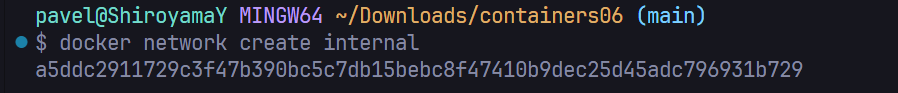
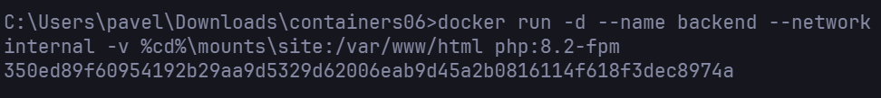
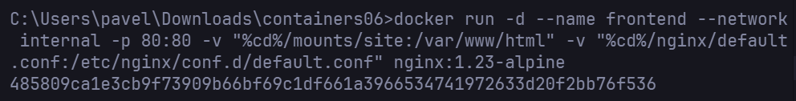

# containers06 Лабораторная работа номер 6 Взаимодействие контейнеров

# Цель работы
Выполнив данную работу студент сможет управлять взаимодействием нескольких контейнеров.

# Задание
Создать php приложение на базе двух контейнеров: nginx, php-fpm.

# Подготовка
Для выполнения данной работы необходимо иметь установленный на компьютере Docker.

Для выполнения работы необходимо иметь опыт выполнения лабораторной работы №3.

## Для выполнения следующей лабораторной работы необходимо выполнить следующие шаги:

1. Создать сеть internal.
2. Создать докер контейнер на базе образа php:8.2-fpm для запуска php fpm который будет управлять пулом php процессов
3. Исправить root в nginx конфиге исходя из расположения входной точки приложения в случае laravel это public/index.php то есть /var/www/html/public
4. Создать докер контейнер на базе образа nginx:1.23-apline 


### 1. Создаем сеть internal


### 2. Создаю докер контейнер на базе образа php:8.2-fpm для запуска php fpm который будет управлять пулом php процессов:


### 3. Исправить root в nginx конфиге исходя из расположения входной точки приложения в случае laravel это public/index.php то есть /var/www/html/public
```
...
    root /var/www/html/public;
...
```

### 4. Создать докер контейнер на базе образа nginx:1.23-apline 


## Первая команда (запуск Nginx):

```cmd
docker run -d --name frontend --network internal -p 80:80 -v "%cd%/mounts/site:/var/www/html" -v "%cd%/nginx/default.conf:/etc/nginx/conf.d/default.conf" nginx:1.23-alpine
```

1. `docker run` – Запускаю новый контейнер из образа.

2. `-d (detach)` – Запускаю контейнер в фоновом режиме, чтобы он работал независимо от терминала.

3. `--name frontend` – Даю контейнеру имя frontend, чтобы удобнее им управлять.

4. `--network internal` – Подключаю контейнер к сети internal, чтобы он мог общаться с другими контейнерами в этой сети (например, с backend).

5. `-p 80:80` – Пробрасываю порт: порт 80 на хосте (внешний) связываю с портом 80 внутри контейнера (Nginx по умолчанию слушает этот порт).

6. `-v "%cd%/mounts/site:/var/www/html"` – Монтирую папку mounts/site из текущей директории (%cd% в Windows) в /var/www/html внутри контейнера (там будут лежать файлы сайта).

7. `-v "%cd%/nginx/default.conf:/etc/nginx/conf.d/default.conf"` – Монтирую файл конфигурации Nginx (default.conf) из локальной папки в контейнер, заменяя стандартный конфиг.

8. `nginx:1.23-alpine` – Использую облегчённый образ Nginx версии 1.23 на базе Alpine Linux.

## Вторая команда (запуск PHP-FPM):

```cmd
docker run -d --name backend --network internal -v %cd%\mounts\site:/var/www/html php:8.2-fpm
docker run – Запускаю ещё один контейнер.
```

1. `-d` – Опять фоновый режим.

2. `--name backend` – Имя контейнера — backend (это наш PHP-сервер).

3. `--network internal` – Подключаю к той же сети internal, чтобы Nginx мог отправлять PHP-запросы в этот контейнер.

4. `-v %cd%\mounts\site:/var/www/html` – Монтирую ту же папку с файлами сайта, что и в Nginx, чтобы PHP мог обрабатывать те же скрипты.

5. `php:8.2-fpm` – Использую официальный образ PHP 8.2 с PHP-FPM (FastCGI Process Manager), который будет обрабатывать PHP-скрипты.

### В итоге получается следующий flow запроса:

- Nginx (frontend) принимает HTTP-запросы на 80-м порту.

- Если запрос к PHP-файлу, Nginx (через internal сеть) передаёт его в backend (PHP-FPM).

- Оба контейнера используют общую папку mounts/site, поэтому видят одни и те же файлы.


1. Как контейнеры взаимодействуют друг с другом?

> Контейнеры общаются через Docker-сеть internal.
> Nginx передаёт PHP-запросы в backend:9000 (PHP-FPM).
> Имена контейнеров (backend, frontend) резолвятся в их IP-адреса внутри сети.


2. Как видят друг друга контейнеры в сети internal?
> Docker предоставляет внутренний DNS, поэтому контейнеры могут обращаться друг к другу по имени:
```
    fastcgi_pass backend:9000;  # "backend" — имя контейнера PHP-FPM
```

3. Почему нужно было переопределять конфигурацию Nginx?
> Стандартный конфиг Nginx не знает о PHP-FPM.
>
> Необходимо указать:
>
> Куда передавать PHP-запросы (fastcgi_pass).
>
> Где искать PHP-файлы (SCRIPT_FILENAME).
> 
> Как обрабатывать маршруты (try_files).

## Выводы
1. Успешно развёрнуто PHP-приложение на двух контейнерах.

2. Настроено взаимодействие Nginx и PHP-FPM через Docker-сеть.

Освоены:

1. Монтирование файлов в контейнеры.

2. Проброс портов.

3. Настройка Nginx для работы с PHP.
